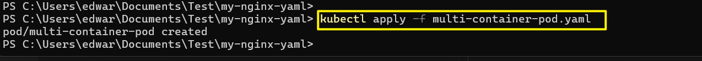
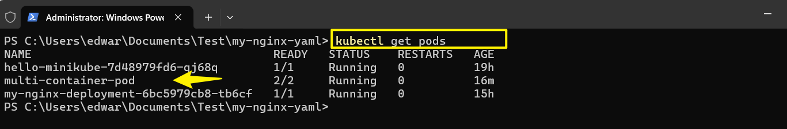
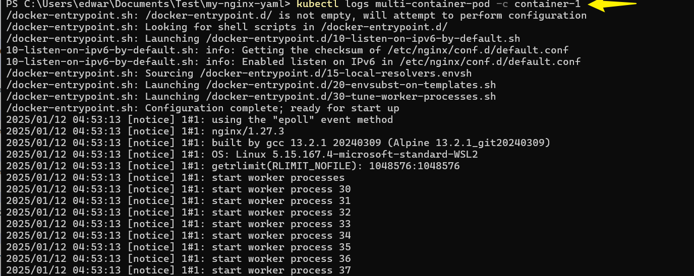
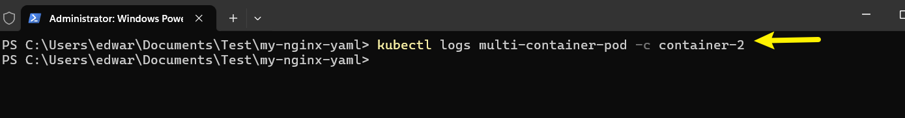
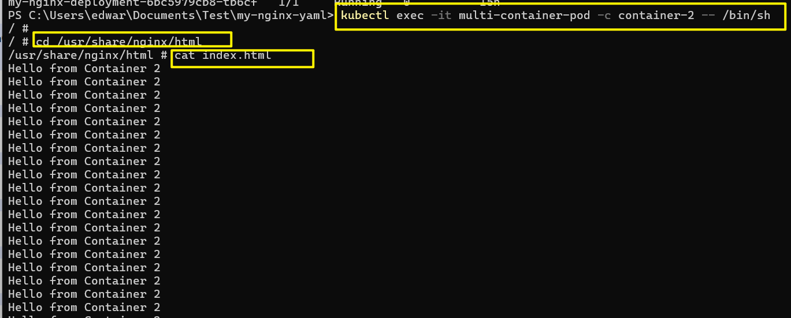

# Networking In Kubernetes

Networking in Kubernetes facilitates communication between containers, services, and the outside world. Kubernetes provides a flexible and very powerful networking model to enable seemless interaction between containers and services whether they are running on same or different nodes across the cluster.

## Some Key Aspects of Networking in Kubernetes

**Pod Networking**: Pod networking is the communication system that allows pods (the smallest deployable units in Kubernetes) to connect and interact with each other and external services. Each pod is assigned a unique IP address, enabling seamless communication within a Kubernetes cluster. Containers within a pod share the same network namespace,enabling them to communicatate with each other using the localhost.


**Service Networking** Service networking in Kubernetes allows applications to communicate with each other, both within and outside the cluster. It achieves this by abstracting and exposing a set of pods as a network service, typically via an IP address and DNS name. This helps maintain stable connections and load balancing, even if individual pod instances change.


**Pod to Pod Communication** Pod-to-Pod communication in Kubernetes relies on each pod having a unique IP address within the cluster, which allows them to communicate directly with each other. Kubernetes' networking model ensures that any pod can reach any other pod without needing NAT (Network Address Translation).

**Ingress** Ingress in Kubernetes is a way to manage external access to services within a cluster, typically using HTTP and HTTPS. It allows you to define rules for routing traffic to the appropriate services based on the URL paths or hostnames.


**Network Policies** Network Policies in Kubernetes are a way to control the communication between pods. They define rules about which pods can communicate with each other and can restrict both ingress (incoming) and egress (outgoing) traffic based on labels and selectors.

**Container Network Interface**The Container Network Interface (CNI) is a specification for configuring network interfaces in Linux containers. It provides a consistent way to manage networking for containerized applications. CNI plugins handle network setup, teardown, and resource allocation, ensuring seamless networking across different container runtimes and environments.


#### *Lets get our hands on pod networking in kubernetes by deploying a pod with multiple containers,showcasing how they share same network namespace and can communicate with each other using `localhost`*. 

Step by step guide using kubernetes and kubectl.

A. **Create a Multicontainer Pod YAML file and paste in it the snippet below**.

```yaml
apiVersion: v1
kind: Pod
metadata:
  name: multi-container-pod
spec:
  containers:
  - name: container-1
    image: nginx:alpine
  - name: container-2
    image: busybox
    command:
      - '/bin/sh'
      - '-c'
      - 'mkdir -p /usr/share/nginx/html && while true; do echo "Hello from Container 2" >> /usr/share/nginx/html/index.html; sleep 10; done'
```

### Detailed Explanation:
1. **apiVersion: v1**
   - This specifies the API version used to create the pod. `v1` is the core version for basic Kubernetes objects like Pods.

2. **kind: Pod**
   - This indicates that the configuration is defining a pod. Pods are the smallest deployable units in Kubernetes.

3. **metadata**
   - **name: multi-container-pod**: This assigns the name `multi-container-pod` to the pod.

4. **spec**
   - This section defines the specification of the pod, including the containers it runs.

5. **containers**
   - This lists the containers that will run within the pod. In this example, there are two containers:
   
   - **container-1**
     - **name: container-1**: The first container is named `container-1`.
     - **image: nginx:alpine**: This container uses the `nginx:alpine` Docker image, which is a lightweight version of the Nginx web server.

   - **container-2**
     - **name: container-2**: The second container is named `container-2`.
     - **image: busybox**: This container uses the `busybox` Docker image, which provides a minimalist set of Unix utilities.
     - **command**: This field specifies the command to run inside the container.
       - **'/bin/sh'**: This runs the `sh` shell.
       - **'-c'**: This option tells the shell to run the following command string.
       - The rest of the command creates a directory (`mkdir -p /usr/share/nginx/html`) and enters a continuous loop (`while true; do ...; sleep 10; done`) where it appends the message "Hello from Container 2" to the file `/usr/share/nginx/html/index.html` every 10 seconds.

   The pod has 2 containers- one running the Nginx web server and the other running the Busybox with a simple command to continuously append "Hello from container 2" to the Nginx default file.

B. **Apply the Pod configuration**

        kubectl apply -f multi-container-pod.yaml




C. **Check Pod Status and Logs**

    kubectl get pods



    kubectl logs multi-container-pod -c container-1



    kubectl logs multi-container-pod -c container-2



You will observe that both containers are running within the same pod, and they share the same network namespace. The Nginx container serves its default page, and the BusyBox container continuously update the HTML files.

D. **Access Nginx from BusyBox Container**

     kubectl exec -it multi-container-pod -c container-2 -- /bin/sh



NOW within the BusyBox Container,you can use tools like curl or wget or access http://localhost and see the Nginx page.